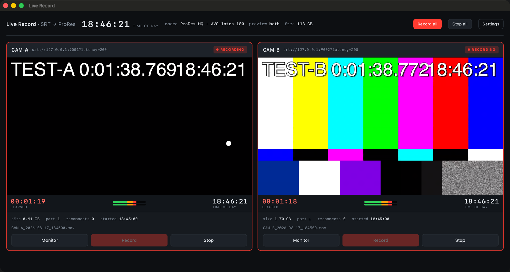

# Live Record



*Two SRT feeds recording simultaneously to ProRes and AVC-Intra, with
time-of-day and elapsed clocks, audio meters and live previews.*

Receives one or more SRT feeds **as the caller** and records each to files an
editor can cut against while they are still being written — Apple ProRes in a
growing QuickTime, AVC-Intra in a growing MXF, or both from one connection.

macOS only. Built on GStreamer and Apple's VideoToolbox.

```
srtsrc(caller) → tsdemux → decode → tee ─┬→ vtenc_prores → qtmux  → .mov  (hardware)
                                         ├→ x264enc → mxfmux      → .mxf
                                         └→ preview (composited, or MJPEG)
```

## Install

```sh
./ship.sh                     # build, bundle, sign -> build/dist/*.dmg
```

The `.dmg` is **self-contained**: it carries its own GStreamer plugins,
libraries, plugin scanner and command-line tools, so a Mac with no Homebrew runs
it. `ship.sh` fails the build if a single load command still points outside the
bundle.

`./ship.sh notarize` also notarises and staples the app and the image, which
Gatekeeper requires before another Mac will open it.

## Building from source

```sh
brew install gstreamer   # the mega-formula: includes srt, applemedia, libav
```

Two builds come from the same source.

### The app

```sh
wails build -tags desktop     # needs ~/go/bin/wails on PATH
open build/bin/liverecord.app
```

A real macOS window. The picture is **composited into the window** — a GPU
surface drawn straight from the decoder at full resolution and full frame rate,
with no scaling and no JPEG encode. Settings live in
`~/Library/Application Support/Live Record/config.json`, and there is a native
folder picker.

To do that the pipelines run **inside the app process**, because
`gst_video_overlay_set_window_handle()` needs the video sink in the same address
space. The trade is deliberate: a GStreamer crash takes the app down rather than
one feed. Robust muxing softens it — every recording on disk stays valid to
within the last index update — but it is a real difference from the CLI.

While the app is running it also serves the same UI on `http://127.0.0.1:7777`,
so a second machine can watch the browser preview.

### The command line

```sh
go build -o liverecord .
./liverecord                 # opens http://127.0.0.1:7777
./liverecord -no-open        # don't launch a browser
./liverecord -out /Volumes/RAID/Show
./liverecord -port 8080
./liverecord -v              # log the full pipeline per feed
```

Pure Go, no cgo. Each feed runs as its own `gst-launch` child, so one feed's
crash cannot touch another's recording — the better choice for an unattended
rack machine. The preview is the in-page MJPEG stream, or a native window per
feed with `"previewMode": "native"`.

Per feed the UI gives you:

| | |
|---|---|
| **Monitor** | connect and preview only — nothing is written |
| **Record** | connect, preview, and write ProRes |
| **Stop** | finalise the file and disconnect |

`Record all` / `Stop all` do the same across every feed at once.

## Configuration

`config.json` is written on first run next to the binary.

Everything below is editable in **Settings** inside the app; the file is only
there for scripted setups. `config.example.json` is a template.

```json
{
  "listenPort": 7777,
  "outputDir": "~/Movies/Live Record",
  "filePattern": "{name}_{date}_{time}",
  "recordProRes": true,
  "recordAvcIntra": true,
  "proresVariant": "hq",
  "avcIntraClass": 100,
  "maxHours": 6,
  "previewMode": "native",
  "feeds": [
    { "name": "CAM-A", "url": "srt://10.0.0.5:9001?latency=200" }
  ]
}
```

- **name** becomes the filename prefix, so keep it filesystem-friendly.
- **url** is the whole connection — paste what your encoder shows. `latency`,
  `streamid` and `passphrase` are read from the query string.
- **filePattern** — tokens `{name}` `{date}` `{time}` `{datetime}`.
- **recordProRes / recordAvcIntra** — either or both. ProRes is the master;
  the MXF is the one Premiere treats as a growing file.
- **previewMode** — `native` (composited GPU surface), `browser` (MJPEG in the
  page, works from another machine), or `both`.
- **proresVariant** — `proxy`, `lt`, `standard`, `hq`, `4444`, `4444xq`.
- **latency** — SRT receive buffer in ms. Rule of thumb: 3–4× the round-trip
  time. 200 is fine on a LAN; use 500–1000 over the public internet.
- **streamId / passphrase** — set these if the sender requires them.
- **maxHours** — index space reserved in the file header up front. Recording
  past it stops cleanly rather than corrupting, so leave headroom.

Add or remove entries in `feeds` to change how many feeds are handled; the UI
lays out as many as you configure. Restart after editing.

## Why the files are readable while still recording

A normal QuickTime file only becomes playable when the muxer writes its index
(the `moov` atom) at the end — so a recording in progress, or one interrupted by
a crash, is just an unreadable pile of bytes.

This app runs `qtmux` in **robust recording mode**: it reserves index space at
the *front* of the file and rewrites the `moov` every second. The result is a
flat, ordinary `.mov` — no fragments — that is a complete, valid QuickTime movie
at every instant:

```
ftyp | moov (rewritten every 1s) | free (reserved) | mdat (size 0 → grows to EOF)
```

This is the same mechanism hardware recorders (AJA Ki Pro, Softron
MovieRecorder) use for edit-while-ingest. Two consequences worth knowing:

- **It is crash-safe.** `kill -9` the app and you keep everything written up to
  the last index update. Verified.
- **The reserved header costs space, permanently.** At the default 6 hours a
  file starts at ~60 MB before a single frame lands, and that padding stays in
  the finished file — reclaiming it would mean rewriting the whole thing. It is
  fixed overhead per file, set by `maxHours`, and negligible next to ProRes
  itself (~100 GB/hour). Lower `maxHours` if you record many short takes.

## Output

```
CAM-A_2026-08-14_143052.mov       Apple ProRes HQ (apch), 10-bit 4:2:2
CAM-A_2026-08-14_143052_pt2.mov   + PCM 24-bit 48 kHz stereo
```

If a feed drops, the app redials with backoff. Since a QuickTime file cannot be
resumed once its process is gone, the recording continues in `_pt2`, `_pt3`, …
The other feeds are unaffected — each runs in its own process.

## The Premiere panel

```sh
./install-panel.sh          # then restart Premiere
```

`Window > Extensions > Live Record Refresh`. Set an interval, press Start, and
leave it. It walks the project, works out which clips are still being written,
and calls `refreshMedia()` on those — so the picture keeps extending without
tabbing out of Premiere and back.

Growth is detected from the file itself, not from Premiere: a clip counts as
growing if its size increased since the last poll, or its modification time is
within the last 25 seconds. Either signal alone is unreliable — size needs a
previous sample, and mtime covers the gaps where size briefly holds steady —
so both are used.

Why it exists: Premiere only applies its growing-file machinery to formats whose
importer declares growing support. A growing MXF gets it; a growing ProRes
QuickTime does not, which is why the clip never goes italic, the refresh
interval never fires for it, and the Source Monitor's Force Media Refresh button
does nothing. `refreshMedia()` is a different code path from that button — the
application posts two distinct internal messages — and it does move the
duration. Measured on Premiere Pro 26.2.

The panel is unsigned, so `PlayerDebugMode` has to be set; the installer does
that. Node has to be enabled in the manifest too, or the diagnostics that need
the filesystem are unavailable.

Under Diagnostics there are the other techniques that were tried —
`changeMediaPath()` via a hardlink, `pauseGrowing()`, and an offline/online
round trip — kept because they report before/after durations and are useful if
a future Premiere changes behaviour.

## Premiere Pro

Enable **Preferences → Media → "Automatically refresh growing files"**, then
import the `.mov` while it is recording.

Adobe formally documents growing-file support for MXF; growing QuickTime is
widely used but is not on their supported list. The files this app writes are
structurally correct for it (index-first, valid at every instant — Apple's own
AVFoundation demuxer reads them mid-write), so **verify this end to end before
you rely on it for a show.** If your Premiere version refuses to extend the
duration on refresh, the fallback is to work from completed `_ptN` parts, or to
switch the muxer to MXF OP1a — `mxfmux` is present in the same GStreamer install
and also carries ProRes.

## Operational notes

- **Disk rate.** ProRes HQ at 1080p25 is ~220 Mb/s ≈ 100 GB/hour *per feed*.
  The header shows free space; keep an eye on it. Use `lt` to roughly halve that.
- **"no data" badge** means the pipeline is up but media stopped arriving —
  usually the encoder or the network, not this app. The file stops growing and
  stays valid.
- **Feeds needing both audio and video.** The muxer waits for every track before
  writing anything, so a feed that advertises audio but never sends it produces
  a file that never grows. The UI calls this out after 15 seconds rather than
  sitting there looking healthy.
- **Stopping cleanly is preferred but not required.** Ctrl-C (or Stop) pushes
  EOS so the final index is written for the exact last frame. A hard kill still
  leaves a valid, playable file — you lose at most the last second, whatever had
  not yet made it into an index update.

## Testing without an encoder

```sh
./testsrc.sh          # two SRT listeners on 9001 and 9002
./testsrc.sh 9001     # just one
./testsrc.sh stop
```

These send 1080p25 H.264 + AAC over MPEG-TS as SRT *listeners*, so the app dials
them exactly as it would a real encoder. The default `config.json` already
points at them.
